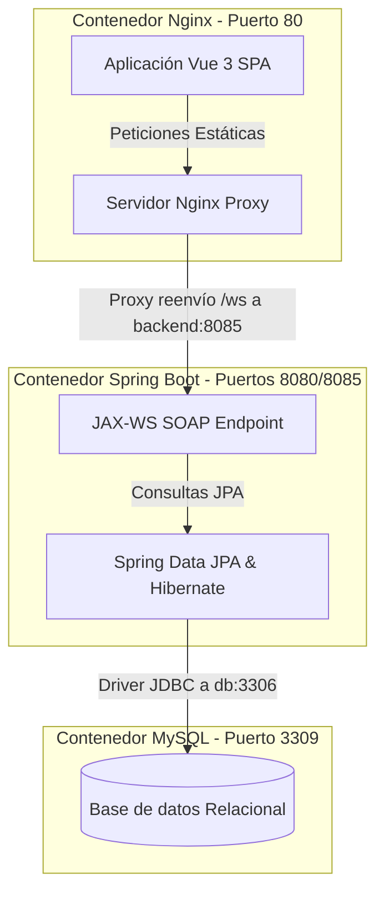

# 🌌 Arquitectura del Sistema

Esta sección describe a detalle la arquitectura de **Cafetería Ambrosia**, explicando cómo interactúan los componentes, las redes virtuales de Docker y la serialización XML en las comunicaciones SOAP.

---

## 1. Diagrama de Bloques

A continuación se muestra cómo viajan los datos desde el cliente web (frontend) hasta la base de datos relacional (MySQL):

---

## 2. Descripción de Componentes

### A. Capa de Presentación (Frontend)
Desplegado en un contenedor **Nginx** de producción.
*   **Vue 3 SPA**: Carga estáticamente en el navegador del cliente. Todo el procesamiento de estados, reactividad, validación de permisos de rutas y construcción de peticiones SOAP se realiza en el lado del cliente.
*   **Nginx como Proxy Inverso**: Dado que el frontend se sirve en el puerto `80` y el backend SOAP se publica en el puerto `8085`, para evitar problemas de CORS (Cross-Origin Resource Sharing), Nginx actúa como un proxy inverso. Captura todas las peticiones dirigidas a `/ws/*` y las redirige internamente a `http://backend:8085/ws/*`.

### B. Capa de Negocio (Backend)
Desplegado en un contenedor **Spring Boot** (Java 21).
*   **JAX-WS (Jakarta XML Web Services)**: Es la especificación utilizada para publicar endpoints SOAP. Los servicios escuchan en el puerto `8085`. Al arrancar el servidor, JAX-WS expone dinámicamente el WSDL (Web Services Description Language), que describe detalladamente los métodos, parámetros y tipos de retorno del servicio web.
*   **Spring Boot**: Administra la inyección de dependencias, la configuración del origen de datos, y los componentes JPA.

### C. Capa de Datos (Base de Datos)
Desplegado en un contenedor **MySQL 8.0**.
*   **Persistencia**: Gestionada por **Hibernate** (JPA). La base de datos es creada automáticamente (`ddl-auto=update`) si no existe.
*   **Idempotencia**: Al iniciar la base de datos por primera vez en el contenedor, se lee el archivo [db-init/init.sql](file:///d:/Data-Analytic-Proyect/cafeteria-soap/db-init/init.sql) para crear las tablas y rellenar los datos de las bebidas, categorías y credenciales de prueba con `INSERT ... ON DUPLICATE KEY UPDATE` para evitar duplicación.

---

## 3. Redes Virtuales de Docker (Docker Network)

Para posibilitar la comunicación entre contenedores sin exponer puertos sensibles al exterior, se define una red bridge denominada `cafeteria-network` en [docker-compose.yml](file:///d:/Data-Analytic-Proyect/cafeteria-soap/docker-compose.yml):

*   **MySQL (`cafeteria-db`)**: Expone internamente el puerto `3306` dentro de la red del contenedor. No es accesible de forma general excepto mediante el puerto remapeado `3309` en el host.
*   **Backend (`cafeteria-backend`)**: Utiliza el hostname `db` en su cadena de conexión (`jdbc:mysql://db:3306/cafeteria_db`) para resolver automáticamente la IP del contenedor de base de datos a través del DNS interno de Docker.
*   **Nginx (`cafeteria-frontend`)**: Utiliza el hostname `backend` para redirigir peticiones SOAP (`proxy_pass http://backend:8085;`).
